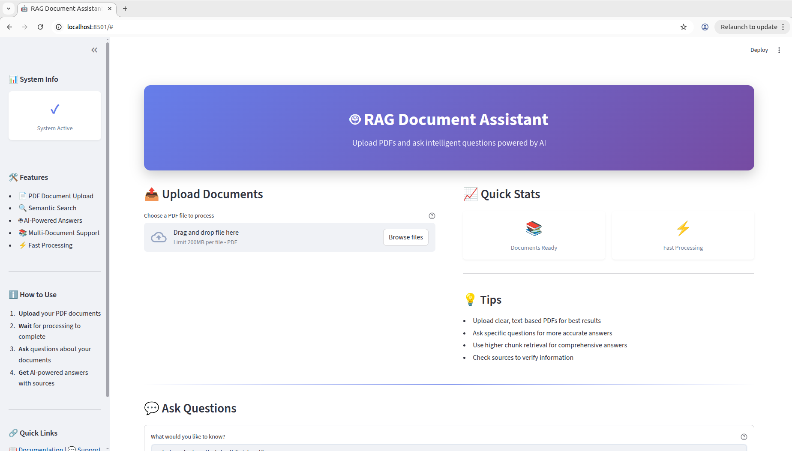
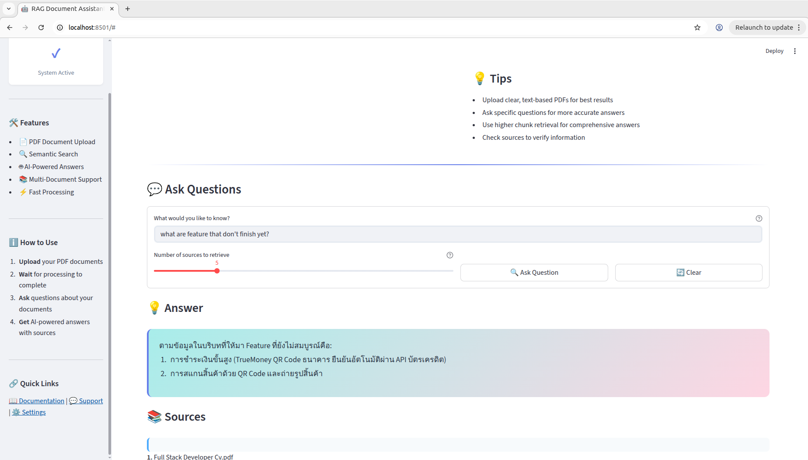

# RAG Product App

A Retrieval-Augmented Generation (RAG) application that processes PDF documents and enables intelligent question-answering using local LLM models through Ollama.

## 📸 Application Screenshots

### Main Interface


### Upload and Query Interface


## 🚀 Features

- **PDF Document Processing**: Upload and process PDF files for knowledge extraction
- **Vector Database Storage**: Efficient document embedding storage using Qdrant
- **Local LLM Integration**: Uses Ollama (llama3.2) for privacy-focused AI responses
- **Async Workflow**: Inngest-powered background processing for document ingestion
- **RESTful API**: FastAPI backend for robust API endpoints
- **Interactive UI**: Streamlit-based frontend for easy interaction

## 🛠️ Technology Stack

### Core Technologies

| Technology | Version | Purpose |
|------------|---------|---------|
| **FastAPI** | Latest | REST API framework for backend services |
| **Ollama** | llama3.2 | Local LLM for generating responses |
| **Qdrant** | Latest | Vector database for storing embeddings |
| **LlamaIndex** | Latest | Framework for building RAG applications |
| **Inngest** | Latest | Workflow orchestration and async processing |
| **Streamlit** | Latest | Frontend UI for user interaction |
| **Python** | 3.x | Primary programming language |

### Key Dependencies

- `llama-index-core`: Core RAG functionality
- `llama-index-readers-file`: PDF file reading
- `llama-index-llms-ollama`: Ollama LLM integration
- `llama-index-embeddings-ollama`: Embedding generation (nomic-embed-text)
- `qdrant-client`: Vector database client
- `uvicorn`: ASGI server
- `python-dotenv`: Environment variable management

## 📋 Prerequisites

- Python 3.x
- Docker (for Qdrant)
- Node.js & npm (for Inngest CLI)
- Ollama installed locally

## 🔧 Installation

### 1. Initialize Project

```bash
uv init .
```

### 2. Install Dependencies

```bash
# Core dependencies
uv add fastapi inngest llama-index-core llama-index-readers-file python-dotenv qdrant-client uvicorn streamlit openai

# Ollama integration
uv add ollama
uv add llama-index-llms-ollama
uv pip install llama-index-embeddings-ollama

# Additional utilities
pip install requests
```

### 3. Download Embedding Model

```bash
ollama pull nomic-embed-text
ollama pull llama3.2
```

### 4. Setup Vector Database (Qdrant)

```bash
# Run Qdrant in Docker
docker run -d --name qdrant -p 6333:6333 -v "./qdrant_storage:/qdrant/storage" qdrant/qdrant

# Start Qdrant container
docker start qdrant

# Verify container is running
docker ps -a
```

### 5. Create Data Directory

```bash
mkdir data
# Place your PDF files in the data directory
```

## 🚀 Running the Application

### Terminal 1: Start FastAPI Server

```bash
uv run uvicorn main:app --reload
```

The API will be available at `http://127.0.0.1:8000`

### Terminal 2: Start Inngest Dev Server

```bash
npx inngest-cli@latest dev -u http://127.0.0.1:8000/api/inngest
```

This enables the background workflow processing for document ingestion.

### Terminal 3: Start Streamlit UI

```bash
streamlit run app.py
```

The UI will be available at `http://localhost:8501`

## 📁 Project Structure

```
ragproductapp/
│
├── app.py                 # Streamlit frontend application
├── main.py               # FastAPI backend with API endpoints
├── data_loader.py        # PDF document loading logic
├── vector_db.py          # Qdrant vector database operations
├── custom_types.py       # Type definitions and data models
│
├── data/                 # Directory for PDF documents
│   └── 6520310203.pdf   # Sample document
│
├── qdrant_storage/       # Qdrant database storage (Docker volume)
├── uploads/              # Temporary upload storage
│
├── app.png              # Application screenshot
├── app1.png             # Application screenshot
│
├── pyproject.toml        # Project dependencies (uv)
├── uv.lock              # Locked dependency versions
├── README.md            # This file
└── docs.odt             # Documentation file
```

## 🔄 How It Works

### Inngest Workflow Functions

The application uses Inngest for reliable background processing with three key components:

1. **Triggers**: Event-based activation of workflows
   - Document upload events
   - Processing requests

2. **Flow Control**: Managing workflow execution
   - Sequential processing steps
   - Error handling and retries

3. **Steps**: Individual processing units
   - Document parsing
   - Embedding generation
   - Vector storage

### Processing Pipeline

1. **Document Upload** → User uploads PDF via API/UI
2. **Trigger Event** → Inngest workflow triggered
3. **PDF Parsing** → Extract text from document
4. **Chunking** → Split text into manageable segments
5. **Embedding** → Generate vectors using nomic-embed-text
6. **Storage** → Store vectors in Qdrant database
7. **Query** → User asks questions
8. **Retrieval** → Find relevant document chunks
9. **Generation** → Ollama llama3.2 generates contextual answer

## ⚙️ Configuration

Create a `.env` file for environment variables:

```env
QDRANT_HOST=localhost
QDRANT_PORT=6333
OLLAMA_BASE_URL=http://localhost:11434
EMBEDDING_MODEL=nomic-embed-text
LLM_MODEL=llama3.2
```

## 🔍 Why This Tech Stack?

- **Ollama (llama3.2)**: Privacy-focused, runs locally, no API costs, full data control
- **Qdrant**: High-performance vector similarity search, Docker-ready
- **LlamaIndex**: Simplified RAG implementation, flexible and modular
- **Inngest**: Reliable async processing, automatic retries, observable workflows
- **FastAPI**: Fast, modern, automatic API documentation
- **Streamlit**: Rapid UI development, Python-native

## 💡 Usage Examples

### Upload a PDF Document

1. Navigate to the Streamlit UI at `http://localhost:8501`
2. Click on "Choose a PDF" in the upload section
3. Select your PDF file
4. Wait for the success message

### Ask Questions

1. Type your question in the text input field
2. Adjust the number of chunks to retrieve (default: 5)
3. Click "Ask Question"
4. View the AI-generated answer and sources

## 🐛 Troubleshooting

### Qdrant Connection Issues
```bash
docker ps -a  # Check if Qdrant is running
docker start qdrant  # Start if stopped
docker logs qdrant  # Check logs for errors
```

### Ollama Model Not Found
```bash
ollama list  # Check installed models
ollama pull llama3.2  # Download if missing
ollama pull nomic-embed-text  # Download embedding model
```

### Inngest Not Connecting
- Ensure FastAPI server is running on port 8000
- Check Inngest dev server URL matches your API endpoint
- Verify the Inngest webhook is properly configured

### Port Already in Use
```bash
# Find process using port 8000
lsof -i :8000

## 📊 Performance Tips

- For faster processing, use PDFs with clear text (not scanned images)
- Adjust `top_k` parameter based on document complexity
- Monitor Docker container resources for Qdrant
- Use SSD storage for Qdrant data directory for better performance

## 🔐 Security Considerations

- All data is processed locally - no external API calls
- PDF files are stored in the `uploads/` directory
- Qdrant database is stored in `qdrant_storage/` directory
- Consider adding authentication for production deployments
- Implement rate limiting for API endpoints

## 🚀 Future Enhancements

- [ ] Support for multiple file formats (DOCX, TXT, CSV)
- [ ] User authentication and multi-tenancy
- [ ] Conversation history and chat memory
- [ ] Advanced filtering and metadata search
- [ ] Export answers and sources to PDF
- [ ] Real-time collaborative document analysis
- [ ] Integration with cloud storage (S3, Google Drive)
- [ ] Custom embedding models support

## 📝 License

**Mr.Chhery Chorn**


## 📞 Support

If you encounter any issues or have questions:

- Open an issue on GitHub
- Check the [Documentation](docs.odt)
- Review existing issues for solutions

## 🙏 Acknowledgments

- LlamaIndex team for the excellent RAG framework
- Ollama team for local LLM capabilities
- Qdrant team for the vector database
- Inngest team for workflow orchestration
- Streamlit team for the UI framework

---

**Status**: ✅ Working Successfully

**Last Updated**: October 2025

**Version**: 1.0.0